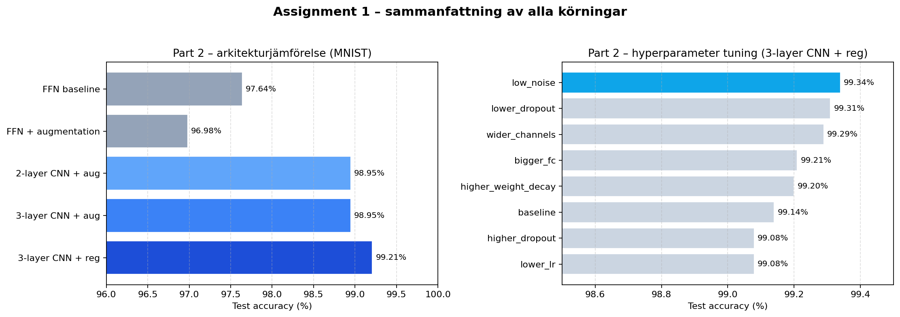

# Assignment 1 – Bildklassificering med FFN, CNN och transfer learning

> **TL;DR.** Två datasets, två frågor jag ville svara på:
>
> 1. **MNIST (Part 2):** kan en CNN slå en enkel FFN, och hjälper regularization?
>    Ja — jag gick från **97.64%** (FFN-baseline) → **99.21%** (3-layer CNN + dropout/BN/weight decay), och hyperparameter-tuning pressade det vidare till **99.34%**.
> 2. **Cats vs Dogs (Part 3):** kan transfer learning slå en CNN tränad från grunden?
>    Ja — ResNet50 (förtränad på ImageNet) når högre accuracy med betydligt mindre data och färre epoker.
>
> Det jag tycker är viktigast är inte siffrorna i sig utan att alla körningar är spårbara: varje körning sparas i en egen `outputs/run_<timestamp>/`-mapp med config, checkpoints, plottar och TensorBoard-loggar, så jag faktiskt kan reproducera dem månader senare.



---

## Innehåll

```
assignment1/
├── README.md                          # denna fil
├── requirements.txt                   # Python-miljö (torch, mlflow, tensorboard, ...)
│
├── rapport_assignment1_part2.md       # rapport (markdown)
├── rapport_assignment1_part2.ipynb    # rapport (notebook med stylad rendering)
├── rapport_assignment1_part2.html     # rapport (exporterad HTML)
│
├── neuron.py                          # mini-experiment med en enkel "neuron"
├── numpy_dense_layer.py               # Del 1B: NumPy Dense/ANN-lager (W @ x + b)
├── mnist_loader.py                    # FFN-baseline
├── mnist_loader_2_layer_CNN.py        # 2-layer CNN
├── mnist_loader_3_layer_CNN.py        # 3-layer CNN
├── mnist_loader_augment.py            # FFN med data augmentation
├── mnist_loader_regularization.py     # 3-layer CNN + dropout/BN/weight decay
├── mnist_loader_tuning.py             # hyperparameter-svep över regularization-modellen
│
├── assignment1_part3_cifar_catsdogs.py  # Part 3: scratch-CNN och ResNet50
│
├── tools/
│   ├── experiments_summary.json       # kanonisk sammanställning av Part 2-resultat
│   ├── make_summary_plot.py           # genererar outputs/summary_all_runs.png
│   └── log_to_mlflow.py               # loggar befintliga runs till MLflow
│
├── outputs/                           # alla MNIST-runs (en mapp per körning)
└── outputs_catsAndDogs/               # alla Cats vs Dogs-runs
```

---

## Del 1B – NumPy-lager (obligatoriskt)

Det obligatoriska lite-mer-från-grunden-momentet ligger i `numpy_dense_layer.py`: ett Dense/ANN-lager i NumPy där forward-passet är just \(W @ x + b\). Inget magiskt, men bra att ha skrivit själv för att förstå vad som händer på låg nivå.

## Compute/device (GPU)

Alla körningar är gjorda på macOS (Apple Silicon) med PyTorch **MPS** när det gick (annars CPU). Vilken device som faktiskt användes sparas i respektive run-mapps `training_config.json` som fältet `device`, så det går att kolla i efterhand.

## Part 3 – Data curation (Cats vs Dogs)

I del 3 utgår jag från **CIFAR-10** och kurerar fram ett binärt cats vs dogs-dataset:

- **Filtrering:** behåller CIFAR-10 label-index **3=cat** och **5=dog**.
- **Remap:** mapparlabels till \(\{0,1\}\) med klassnamn `["cat", "dog"]`.
- **Splits:** `train=True` används som train/val-pool, `train=False` som test.
- **Validering:** val-split tas ut från train-poolen i koden.
- **Pool för snabbhet:** för transfer learning kan `max_train_pool` begränsa mängden träningsdata (t.ex. `2500`) så det går att köra på laptop på rimlig tid.

Implementationen ligger i `_curate_cifar10_catsdogs()` i `assignment1_part3_cifar_catsdogs.py`.

## Snabbstart

```bash
# 1. Skapa och aktivera virtuell miljö
python3 -m venv .venv
source .venv/bin/activate

# 2. Installera beroenden
pip install -r requirements.txt

# 3. Träna en modell (en av flera möjliga ingångar)
python3 mnist_loader_regularization.py

# 4. Följ träningen i TensorBoard
tensorboard --logdir outputs/

# 5. Generera översiktsbilden
python3 tools/make_summary_plot.py

# 6. Logga befintliga runs till MLflow och öppna dashboarden
#    (kräver att .venv är aktiverad – annars använd .venv/bin/mlflow direkt)
python3 tools/log_to_mlflow.py
mlflow ui --backend-store-uri ./mlruns      # http://127.0.0.1:5000
```

---

## Resultat

### Part 2 – arkitekturjämförelse (MNIST, 5 epoker var)

| Modell                          | Augmentation | Regularization | Test loss | **Test accuracy** |
| ------------------------------- | :----------: | :------------: | --------: | ----------------: |
| FFN baseline                    |       –      |        –       |    0.0802 |             97.64% |
| FFN + augmentation              |       ✓      |        –       |    0.1016 |             96.98% |
| 2-layer CNN + augmentation      |       ✓      |        –       |    0.0305 |             98.95% |
| 3-layer CNN + augmentation      |       ✓      |        –       |    0.0296 |             98.95% |
| **3-layer CNN + regularization**|     **✓**    |      **✓**     |**0.0217** |        **99.21%** |

### Part 2 – hyperparameter-tuning (3-layer CNN + reg)

Från `outputs/tuning_results.json`. Sorterat efter test accuracy:

| Konfig              | Test accuracy | Test loss | Tränings-tid (s) |
| ------------------- | ------------: | --------: | ---------------: |
| **low_noise**       |     **99.34%**|    0.0222 |             66.5 |
| lower_dropout       |        99.31% |    0.0234 |             49.3 |
| wider_channels      |        99.29% |    0.0218 |             70.3 |
| bigger_fc           |        99.21% |    0.0222 |             58.7 |
| higher_weight_decay |        99.20% |    0.0268 |             47.0 |
| baseline            |        99.14% |    0.0259 |             57.8 |
| higher_dropout      |        99.08% |    0.0260 |             56.3 |
| lower_lr            |        99.08% |    0.0264 |             45.5 |

### Part 3 – Cats vs Dogs

- **scratch-CNN** vid `img_size=128`, 5 epoker → se `outputs_catsAndDogs/catsAndDogs__scratch__img128__OK__run_*`
- **ResNet50 (transfer learning)** vid `img_size=64`, 3 epoker → se `outputs_catsAndDogs/catsAndDogs__resnet50__img64__pool2500__OK__run_*`

Detaljerade kurvor och confusion matrices finns i respektive run-mapp samt i TensorBoard.

---

## Reproducerbarhet och MLOps

Inspirerat av [Experiment Tracking with MLflow, Weights & Biases & Neptune](https://www.youtube.com/watch?v=KkiqTLQbAys) — *"If you cannot reproduce an experiment, you don't have a result. You have a coincidence."* Det citatet är ungefär hela anledningen till att jag valde att lägga lite extra tid på loggning från början istället för att "bara köra".

För **varje** körning sparas:

| Artefakt                       | Vad det innehåller                                           |
| ------------------------------ | ------------------------------------------------------------ |
| `training_config.json`         | Alla hyperparametrar: lr, batch_size, epochs, dropout, m.fl. |
| `epoch_NNN.pt`                 | Checkpoint efter varje epok (model + optimizer + history)    |
| `best.pt`                      | Bästa checkpoint enligt validation loss                      |
| `curves_loss_acc.png`          | Träningskurvor (loss + accuracy per epoch)                   |
| `confusion_matrix_percent.png` | Confusion matrix på testset, normaliserat per sann klass     |
| `examples_correct.png`         | Exempel på rätt klassificerade bilder                        |
| `examples_incorrect.png`       | Exempel på felklassificerade bilder                          |
| `tensorboard/`                 | Live-loggar (loss, accuracy, throughput, augmentation-preview) |

### Verktygsval

| Verktyg         | Vad jag använder det till                                 | Varför just det                          |
| --------------- | --------------------------------------------------------- | ---------------------------------------- |
| **TensorBoard** | Live träningskurvor, augmentation-preview                 | Inbyggt i PyTorch, ingen extra setup     |
| **Run-mappar**  | Reproducerbarhet, checkpoints, plottar                    | Egen lättviktig lösning, full kontroll   |
| **MLflow**      | Dashboard för att jämföra alla runs sida vid sida         | Industristandard för experiment tracking |
| **Notebook**    | Pedagogisk berättelse i rapporten                         | Bra för att granska och förklara         |

### Hur man läser en gammal körning

```bash
# Visa konfig och resultat
cat outputs/run_20260422_151947/training_config.json

# Träningskurvor + confusion matrix
open outputs/run_20260422_151947/curves_loss_acc.png
open outputs/run_20260422_151947/confusion_matrix_percent.png

# TensorBoard för just denna körning
tensorboard --logdir outputs/run_20260422_151947/tensorboard
```

---
