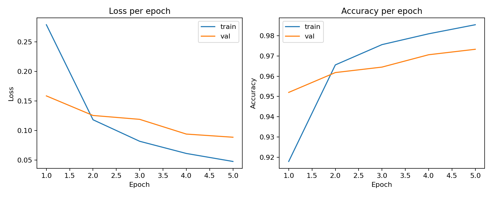
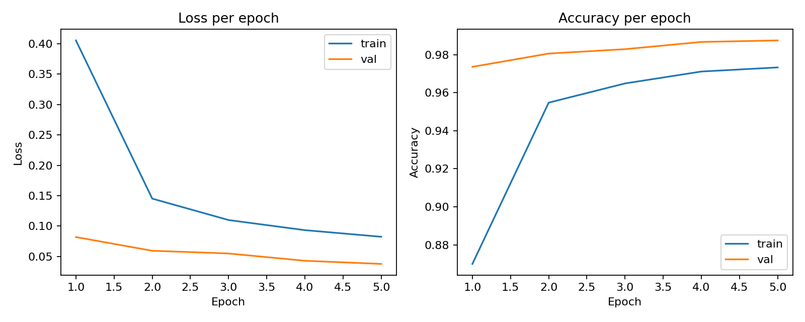
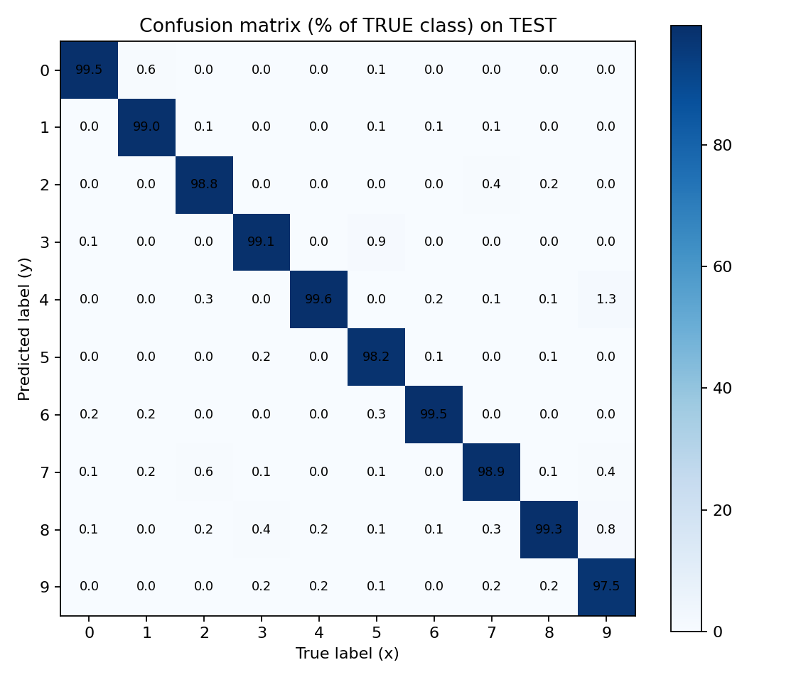
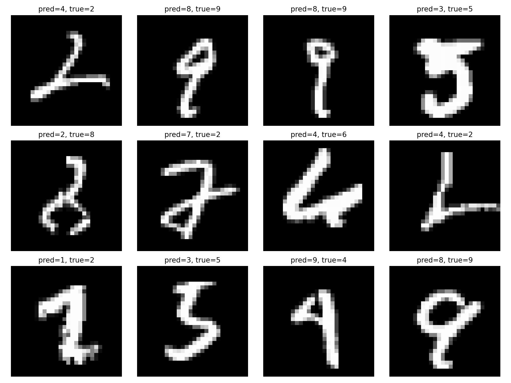
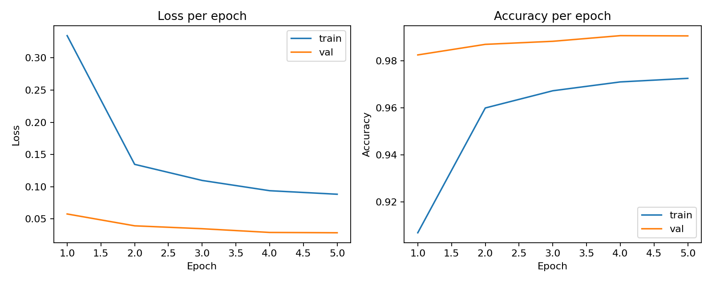

# Rapport: Assignment 1 Part 2

## TL;DR

- **Uppgift:** Klassificera handskrivna siffror (MNIST) och jämföra hur en enkel feed-forward-modell står sig mot olika CNN-varianter.
- **Bästa modell:** 3-layer CNN med dropout, batch normalization och weight decay nådde **99.21%** test accuracy mot 97.64% för en enkel FFN-baseline.
- **Bästa tuning-körning:** "low_noise"-konfigurationen pressade upp resultatet till **99.34%** test accuracy.
- **Arbetssätt:** varje körning sparas i en egen `outputs/run_<timestamp>/`-mapp med `training_config.json`, checkpoints, träningskurvor, confusion matrix och TensorBoard-loggar — så att resultaten är reproducerbara.
- **Översiktsbild:** se `outputs/summary_all_runs.png` för en sammanfattning av alla körningar.

## Inledning
I den här delen av uppgiften var målet att gå vidare från en enkel feed-forward-modell (FFN) till mer bildanpassade lösningar, samt att börja arbeta mer strukturerat med MLOps, data augmentation och experiment med olika nätarkitekturer.

Arbetet utgick från MNIST-datasetet med handskrivna siffror. Modellerna tränades i PyTorch och resultaten följdes i TensorBoard. För varje körning sparades även checkpoints, träningskonfiguration och visuella artefakter som träningskurvor, confusion matrix och exempelbilder.

## Mål
Målet med del 2 var att:

- införa enklare MLOps-arbetssätt
- logga träning och prestanda tydligt
- testa data augmentation
- byta från FFN till CNN
- jämföra olika CNN-arkitekturer

## MLOps och spårbarhet
För att göra experimenten spårbara skapades en egen output-mapp för varje körning:

- `outputs/run_<timestamp>/`

I varje körning sparades bland annat:

- `training_config.json`
- `best.pt`
- checkpoints per epoch
- `curves_loss_acc.png`
- `confusion_matrix_percent.png`
- `examples_correct.png`
- `examples_incorrect.png`
- TensorBoard-loggar i `tensorboard/`

Detta gjorde det möjligt att:

- följa träning steg för steg
- jämföra olika modeller
- hitta bästa checkpoint med hjälp av validation loss
- gå tillbaka och analysera tidigare körningar

TensorBoard användes också för att logga:

- train/validation loss
- train/validation accuracy
- tid per epoch
- total träningstid
- throughput (bilder per sekund)
- exempelbilder och augmentation-preview

## Modell 1: Baseline FFN
Den första modellen var en enkel feed-forward network där bilden först flattenades från `28x28` till en vektor med 784 värden och sedan skickades genom två fully connected layers.

Arkitektur i korthet:

- `Flatten`
- `Linear(784, 128)`
- `ReLU`
- `Linear(128, 10)`

Den här modellen fungerade, men tar inte vara på att indata faktiskt är en bild. Därför blir den mindre lämpad än CNN för bildklassificering.

## Data augmentation
För att göra modellen mer robust testades data augmentation på träningsdatan. Augmentationen applicerades bara på train-setet, medan validation och test hölls rena för att ge rättvis utvärdering.

Följande augmentation användes:

- liten rotation
- liten förskjutning
- liten skalning
- liten shear
- Gaussian noise

Syftet var inte att göra bilderna tydligare, utan att skapa rimliga variationer så att modellen inte lär sig alltför exakt hur varje enskild träningsexempel ser ut.

För att göra augmentation lätt att förstå loggades i TensorBoard en preview som visar:

- originalbild
- flera augmenterade versioner av samma bild

Detta gör det enkelt att se hur samma siffra kan förändras mellan olika träningspass.

## Regularization
Regularization används för att minska risken för overfitting. Tanken är att modellen inte ska bli alltför specialiserad på träningsdatan, utan i stället lära sig mer generella mönster som också fungerar bra på validation- och testdata.

I den här uppgiften testades tre vanliga regularization-metoder:

### Dropout
Dropout betyder att vissa neuroner slumpmässigt stängs av under träningen. Modellen kan då inte lita för mycket på en enda väg genom nätverket, utan måste sprida ut sitt lärande över fler neuroner.

Pedagogiskt kan man tänka att modellen tvingas \"träna utan några av sina favoritneuroner\" i varje steg. Det brukar minska overfitting.

### Batch normalization
Batch normalization används för att hålla aktiveringarna i nätverket mer stabila mellan olika lager. Det gör ofta träningen jämnare och snabbare, och kan också ge en viss regularization-effekt.

I CNN-modeller placeras batch normalization ofta direkt efter ett convolutional layer. Det hjälper modellen att träna mer stabilt även när nätverket blir djupare.

### Weight decay
Weight decay betyder att stora vikter straffas lite i optimeringen. Det gör att modellen inte lika lätt får väldigt extrema parameter-värden.

Pedagogiskt kan man säga att modellen uppmuntras att hålla sig till enklare lösningar i stället för att överanpassa sig till detaljer i träningsdatan.

### Varför det här är viktigt
Om regularization fungerar som tänkt kan man ofta se att:

- train accuracy kanske blir lite lägre än utan regularization
- men validation- och testresultat blir bättre eller stabilare
- skillnaden mellan train och val minskar

Det betyder att modellen generaliserar bättre, alltså fungerar bättre på ny data som den inte tränat på tidigare.

## CNN: varför convolutional layers?
Nästa steg var att byta ut början av modellen till convolutional layers. En CNN är bättre lämpad för bilder eftersom den kan hitta lokala mönster som:

- kanter
- linjer
- kurvor
- delar av siffror

En viktig idé är translationsinvarians, alltså att modellen ska kunna känna igen samma siffra även om den ligger lite olika i bilden.

Efter convolutional layers användes:

- `ReLU`
- `MaxPool2d`

Pooling minskar dimensionerna och hjälper modellen att fokusera på viktiga features.

## CNN-arkitekturer som testades
Tre huvudvarianter jämfördes:

### 1. FFN-baseline
En enkel dense-modell utan convolutional layers.

### 2. FFN med augmentation
Samma grundmodell som baseline, men med data augmentation på train-setet.

### 3. 2-layer CNN
En CNN med två convolutional layers:

- `Conv2d(1, 16, kernel_size=3, padding=1)`
- `Conv2d(16, 32, kernel_size=3, padding=1)`
- `MaxPool2d(2, 2)` efter conv-lagren

### 4. 3-layer CNN
En djupare CNN med tre convolutional layers:

- `Conv2d(1, 8, kernel_size=3, padding=1)`
- `Conv2d(8, 16, kernel_size=3, padding=1)`
- `Conv2d(16, 32, kernel_size=3, padding=1)`

Den djupare modellen testades för att se om fler conv-lager kunde ge bättre features och därmed bättre resultat.

### 5. 3-layer CNN med regularization
Som sista steg byggdes en ny modell ovanpå 3-layer CNN där tre regularization-metoder lades till:

- `BatchNorm2d` efter convolutional layers
- `Dropout` i fully connected-delen
- `weight_decay` i `Adam`-optimizern

Syftet var att minska overfitting och samtidigt göra träningen mer stabil.

## Features i tidiga och senare conv-lager
Tidiga convolutional layers brukar lära sig enkla features:

- vertikala och horisontella linjer
- diagonaler
- enkla kurvor

Senare conv-lager bygger vidare på dessa och kan lära sig mer komplexa mönster:

- hörn
- slingor
- delar av siffror
- kombinationer av flera linjer och kurvor

Det betyder att de senare lagren ofta fångar mer meningsfulla delar av själva siffran, medan de tidiga lagren mest hittar enkla lokala strukturer.

## Resultat
Följande körningar användes som jämförelse:

| Modell | Run | Best epoch | Test loss | Test accuracy |
| --- | --- | ---: | ---: | ---: |
| FFN baseline | `run_20260422_145158` | 5 | 0.0802 | 0.9764 |
| FFN + augmentation | `run_20260422_145249` | 5 | 0.1016 | 0.9698 |
| 2-layer CNN + augmentation | `run_20260422_145403` | 5 | 0.0305 | 0.9895 |
| 3-layer CNN + augmentation | `run_20260422_145458` | 5 | 0.0296 | 0.9895 |
| 3-layer CNN + regularization | `run_20260422_151947` | 5 | 0.0217 | 0.9921 |

## Tolkning av resultaten
Det tydligaste resultatet var att båda CNN-modellerna presterade bättre än FFN-varianterna.

Några observationer:

- FFN-baseline nådde god prestanda, men låg tydligt under CNN-modellerna.
- FFN med augmentation blev i just denna körning något sämre än baseline.
- 2-layer CNN gav ett stort hopp uppåt i test accuracy.
- 3-layer CNN gav samma test accuracy som 2-layer CNN, men något lägre test loss.
- 3-layer CNN med regularization gav bäst resultat av alla testade modeller.

Det kan tolkas som att:

- CNN är bättre lämpat än FFN för bilddata
- ett extra convolutional layer kan ge något bättre representation, även om skillnaden här var liten
- augmentation förbättrade inte den enkla FFN-modellen i just denna körning
- regularization med dropout, batch normalization och weight decay förbättrade både test loss och test accuracy jämfört med den vanliga 3-layer CNN-modellen

## Viktig begränsning i jämförelsen
Jämförelsen är inte helt perfekt kontrollerad, eftersom:

- baseline-modellen och CNN-varianterna inte har exakt samma arkitekturtyp
- augmentation inte användes i alla modeller
- vissa körningar hade olika upplägg att jämföra

Det betyder att slutsatserna ska tolkas försiktigt. En ännu mer rättvis jämförelse skulle vara att:

1. köra FFN och CNN med exakt samma träningsupplägg
2. köra varje modell både med och utan augmentation
3. hålla antal epochs och övriga hyperparametrar helt lika

## Exempel på sparade artefakter
Nedan visas några exempel på artefakter som sparades under experimenten.

### Baseline FFN: träningskurvor

### 2-layer CNN: träningskurvor

### 3-layer CNN: confusion matrix

### 3-layer CNN: felklassificerade exempel

### 3-layer CNN med regularization: träningskurvor

## Överfitting
Validation loss användes för att avgöra vilken checkpoint som var bäst. Den bästa modellen sparades som `best.pt`.

Det här är viktigt eftersom sista epoken inte alltid är bäst. Om train loss fortsätter minska men validation loss börjar öka, är det ett tecken på overfitting. Genom att välja checkpoint med lägst validation loss blir modellen mer robust.

## Slutsats
Arbetet visade tydligt att CNN är bättre än en enkel FFN för MNIST. De convolutional layers som lades till gjorde att modellen kunde arbeta mer naturligt med bilddata och nå högre accuracy.

Data augmentation gjorde träningsdatan mer varierad och gav en mer realistisk träningssituation, även om det inte automatiskt gav bättre resultat i alla lägen. Regularization med dropout, batch normalization och weight decay gav däremot ett tydligt förbättrat resultat i den sista modellen. Det viktigaste från experimenten är därför inte bara slutvärdet, utan också förståelsen för hur:

- augmentation påverkar data
- CNN skiljer sig från FFN
- olika arkitekturer påverkar resultat
- regularization kan minska overfitting och förbättra generalisering
- TensorBoard och checkpointing gör experiment lättare att följa och jämföra

## Möjligt fortsatt arbete
Om experimenten skulle utvecklas vidare vore naturliga nästa steg:

- köra mer rättvisa kontrollerade jämförelser mellan modeller
- testa dropout och batch normalization
- jämföra modeller med samma parameterstorlek
- logga fler sammanfattande metrics i separata JSON-filer
- visualisera vikter eller feature maps från conv-lagren
